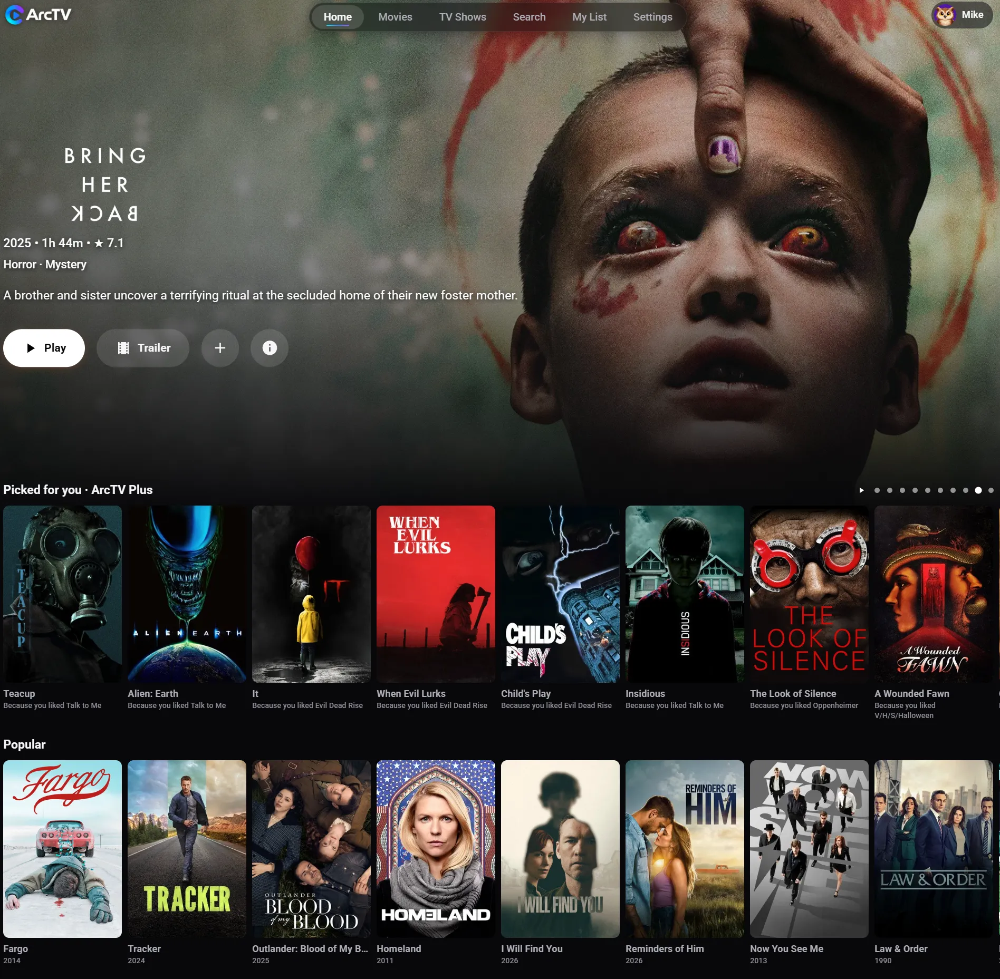

<h1 align="center">Arc TV for Fire TV, Firestick, Android TV and Google TV</h1>

<p align="center"><b>Your streaming, your way, on the big screen.</b><br>
A Netflix-style streaming app for Stremio-protocol addons, made for the remote.</p>

<p align="center">
  <a href="https://github.com/MikeC444/ArcTV-AndroidTV/releases/latest"><b>Download the latest release</b></a> ·
  <a href="#-installing-on-your-tv">Install on your TV</a> ·
  <a href="https://arctv.org">arctv.org</a>
</p>

<p align="center">
  
</p>

Arc TV is a modern media center for your television. It puts everything you want to watch in one place: content comes from **Stremio addons** rather than a fixed catalog, so you choose the addons you want, the same way Stremio itself works. Arc TV ships with no content of its own.

It is made for **Amazon Fire TV and Firestick**, and for **Android TV and Google TV** devices such as Chromecast with Google TV, Nvidia Shield and Android TV sets and boxes. It is built with Kotlin and Jetpack Compose and designed for a remote, with no mouse or touchscreen needed.

## ✨ Features

- **Addon-powered**: discover movies and series from whichever Stremio-protocol addons you install, including torrent addons (no extra app needed)
- **Made for the remote**: every screen is built for D-pad navigation, with the Back and OK buttons doing what you expect
- **Easy sign-in**: scan a QR code and sign in from your phone instead of typing on the TV
- **Sync everywhere**: your My List, Continue Watching, settings and addons follow you between TVs, your [phone](https://github.com/MikeC444/ArcTV-MobileAPK), your [Mac](https://github.com/MikeC444/ArcTV-Mac) and the [web app](https://web.arctv.org)
- **A player that plays more**: VLC's player is the default, so 4K, HEVC and Dolby Vision files that the built-in player can't decode still play (switch players any time in Settings). Surround sound reaches all your speakers, and quality, audio, subtitle and speed menus are a remote press away
- **Pick your source**: a source list with quality badges and sizes and a recommended pick, with a setup guide (open it by scanning a QR code) if you have no sources yet
- **Browse your way**: Home, Movies, TV Shows, Genres and Search, with a detail page for every title and a poster menu with My List, Watched, Like and Not for me
- **Picked for you**: a Home row chosen from the movies and shows you like, finish and save, with the reason under every poster
- **Stays up to date**: the app tells you when a new version is out and what changed (see `RELEASE_NOTES.md`), and Settings has an Updates tab with a Check for updates button
- **ArcTV Plus** (optional; the app stays free): up to 5 profiles with kids profiles and PIN locks, Picked for you, Smart source picking, and your watch stats

## 📱📺 Arc TV everywhere

Same account, same list, same addons on every device:

| | |
|---|---|
| 📺 **Fire TV / Firestick / Android TV / Google TV** | this repository, also home of the account backend (`server/`) |
| 📱 **Android phones and tablets** | [ArcTV-MobileAPK](https://github.com/MikeC444/ArcTV-MobileAPK) |
| 🌐 **Web** | [web.arctv.org](https://web.arctv.org) ([ArcTV-Web](https://github.com/MikeC444/ArcTV-Web)) |
| 💻 **Mac** | [ArcTV-Mac](https://github.com/MikeC444/ArcTV-Mac) |

## 📺 Installing on your TV

Arc TV isn't in an app store yet, so you install it once from outside the store ("sideloading"). The easiest way on **any** of these TVs is the free **Downloader** app, and it takes about two minutes.

### The easy way: Downloader (Fire TV, Firestick, Android TV and Google TV)

1. On your TV, install the free **Downloader** app from the Amazon Appstore (Fire TV) or the Google Play Store (Android TV and Google TV).
2. Let Downloader install apps. When Android asks, or in your TV's settings, switch on **Install unknown apps** (also called **Unknown sources**) for Downloader.
   - Fire TV and Firestick: **Settings → My Fire TV → Developer Options → Install unknown apps → Downloader**
   - Android TV and Google TV: Android will take you to the right screen the first time Downloader tries to install. If you go looking yourself, search your TV's settings for "unknown sources" (the menu names vary between brands).
3. Open Downloader, enter the code **2368012**, and follow the prompts to install Arc TV.

No code or no luck? In Downloader, type `github.com/MikeC444/ArcTV-AndroidTV/releases/latest` and download `app-release.apk` from there.

### The ADB way (any of them)

1. Enable **Apps from Unknown Sources** and **ADB Debugging** in your TV's developer options.
2. `adb connect <tv-ip>:5555`
3. `adb install app-release.apk` (get the file from [the latest release](https://github.com/MikeC444/ArcTV-AndroidTV/releases/latest))

That's it: open Arc TV from your apps list, sign in, add an addon, and start watching. After that, the app tells you when an update is ready.

## ❓ Questions

**Where do the movies and shows come from?** From the Stremio addons you add. Arc TV only plays what an addon provides and does not host or supply any content.

**Is it free?** Yes. Browsing, playing, My List, Continue Watching and addons are free. ArcTV Plus adds extras on top.

**Will it work on my TV?** It needs Android 6.0 or newer (Fire OS 6 or newer on Fire TV) and an Android TV, Google TV or Fire TV launcher. If your device runs Android TV apps, it should run Arc TV.

## 🛠️ For developers

### Status

Arc TV is full-featured and actively growing. On top of the screens above, it has a complete **account, authentication, and cloud synchronization system**. See [`docs/ARCHITECTURE.md`](docs/ARCHITECTURE.md) for how that system works, [`docs/DEPLOYMENT.md`](docs/DEPLOYMENT.md) for running your own backend instance, and [`docs/TESTING.md`](docs/TESTING.md) for how to verify it end-to-end (including reproducing the full multi-device test). `CHANGELOG.md` has the milestone-by-milestone development history.

### How it works

The app is Kotlin and Jetpack Compose on the Fire TV, talking to a small Node/Express/TypeScript backend (`server/`) that keeps your account and library in Neon Postgres. Catalogs and streams come from the addons you install.

### Project structure

```
app/src/main/java/com/mangotv/app/
  data/model/          Content, Genre, Episode, Season, WatchProgress — the shared metadata model
  data/provider/       CatalogProvider interface + ProviderRegistry (Stremio-style addon architecture)
  data/addon/          Stremio addon client/mapper + local-network addon pairing
  data/audio/          Boot chime + UI navigation/click sound playback and preferences
  data/auth/           Session/device identity, encrypted-at-rest session storage (Tink/Android Keystore)
  data/network/        OkHttp + kotlinx.serialization API clients talking to the backend (server/)
  data/sync/           Per-domain cloud sync (settings, watchlist, continue watching, addons), retry queues, account switching
  data/history/        Local Continue Watching cache
  data/player/         Local player-preferences cache
  ui/theme/            Colors, typography, motion tokens, dimens — the design system
  ui/components/       Reusable focusable primitives: TvFocusSurface, ContentCard, ContentRow, MangoButton, ArcLogo, loading/error states
  ui/loading/          Branded cold-boot loading screen
  ui/home/ ui/browse/ ui/detail/ ui/genres/ ui/search/ ui/mylist/ ui/sources/ ui/player/  The main app screens
  ui/player/overlay/   In-player menus: quality, audio/subtitle tracks, playback speed, source info, settings
  ui/auth/             Authentication gate, sign-in start screen, QR sign-in flow
  ui/settings/         Settings, Home Rows, Addons, Account
  navigation/          Jetpack Navigation-Compose routes/nav host

server/                Backend API (Node/Express/TypeScript) sitting between the app and Neon Postgres —
                        see docs/ARCHITECTURE.md and server/README.md
```

### Building

Requires Android Studio (or the command line with an Android SDK installed):

```
./gradlew assembleDebug
```

The debug APK is also built automatically by GitHub Actions on every push (`.github/workflows/build-apk.yml`) and uploaded as a workflow artifact, so a build is available for download without needing a local Android SDK.

## 🤝 Contributing

Ideas, bug reports and pull requests are welcome. Open an issue to say hi or to tell us what you'd love to see next.
